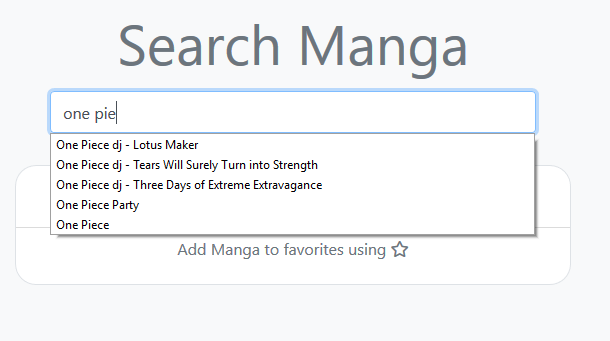
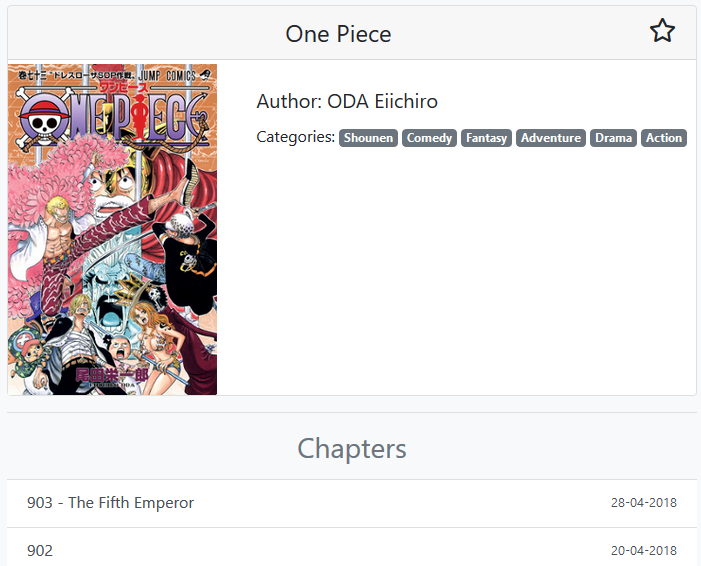
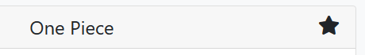
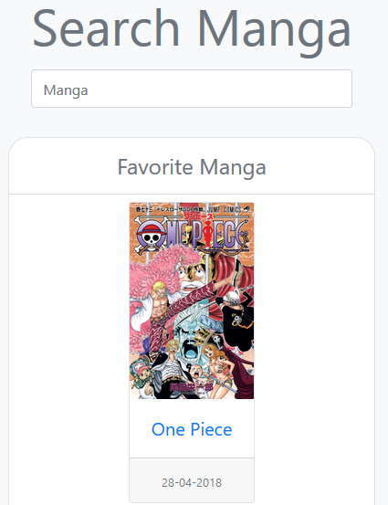

# Manga Viewer

### Application build in Flask for viewing your favorite [**Manga**](https://en.wikipedia.org/wiki/Manga)

### ___Online___: [deployed to Heroku](https://manga-viewer.herokuapp.com/ "Heroku Manga-Viewer")

To access application, it is required to login. Register for a new account or use credentails below:

>username: testing\
>password: testing
---
### API
* App uses external API for pulling data about mangas and chapter images: [Manga Eden API](https://www.mangaeden.com/api "API")
---
## Overview

* Search bars are displaying suggestions dynamically while typing title of Manga

  

* Manga Info Page, showing information, chapters and their release date

    

* **Add to favorites** function, makes Manga easy accessed from main page

    

* Main Page with favorite Manga

    

* View Chapter pages one below another 

    

